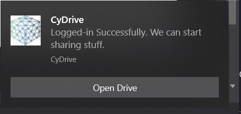

## beeep
[](https://travis-ci.org/gen2brain/beeep) 
[](https://ci.appveyor.com/project/gen2brain/beeep)
[](https://godoc.org/github.com/gen2brain/beeep) 
[](https://goreportcard.com/report/github.com/gen2brain/beeep) 
<!--[](http://gocover.io/github.com/gen2brain/beeep)-->

`beeep` provides a cross-platform library for sending desktop notifications, alerts and beeps.

### Installation

    go get -u github.com/saftrus/beeep-notify

### Examples

```go
var action [][]string
action = append(action, []string{"protocol", "Open Drive", "getPath"})
beeep.Notify("CyDrive", "Logged-in Successfully. We can start sharing stuff.", "s.jpg", action)
```



## macOS

For icons to show up when using Alert() or Notify(), you will need to bundle your application
with a app icon.

## More

For cross-platform dialogs and input boxes see [dlgs](https://github.com/gen2brain/dlgs).
